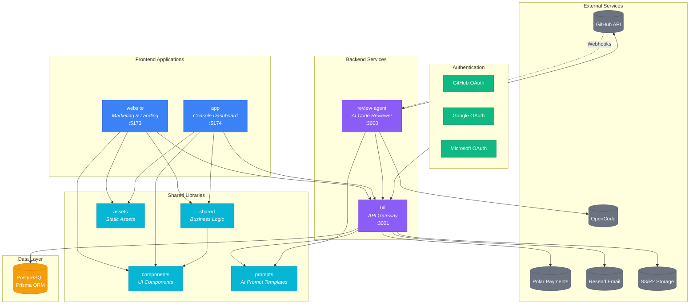
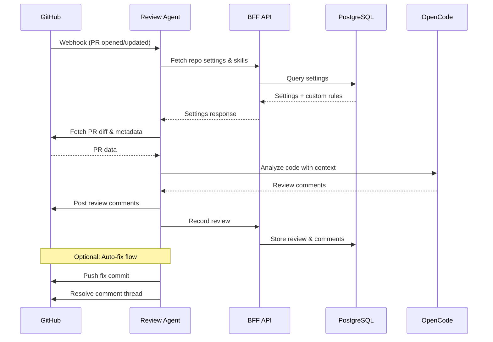
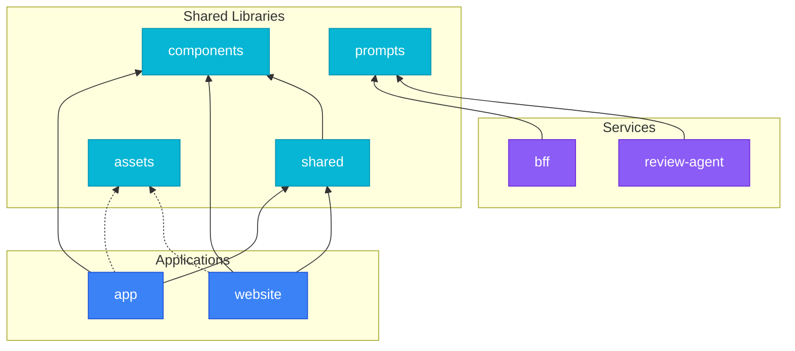
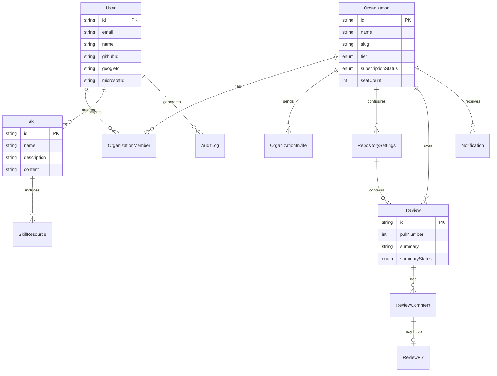

# OpenDiff Architecture

## System Overview

## Code Review Flow

## Package Dependencies

## Data Model

## Technology Stack

| Layer | Technologies |
|-------|-------------|
| **Frontend** | React 19, Vite, Tailwind CSS 4, React Router, React Query |
| **UI** | Radix UI, shadcn/ui, Framer Motion |
| **Backend** | Hono, Bun, Prisma |
| **Database** | PostgreSQL |
| **AI** | OpenCode SDK, Anthropic API |
| **Auth** | GitHub, Google, Microsoft OAuth |
| **Payments** | Polar, Stripe |
| **Infrastructure** | S3/R2, Resend |

## Ports

| Service | Port |
|---------|------|
| website | 5173 |
| app | 5174 |
| bff | 3001 |
| review-agent | 3000 |
